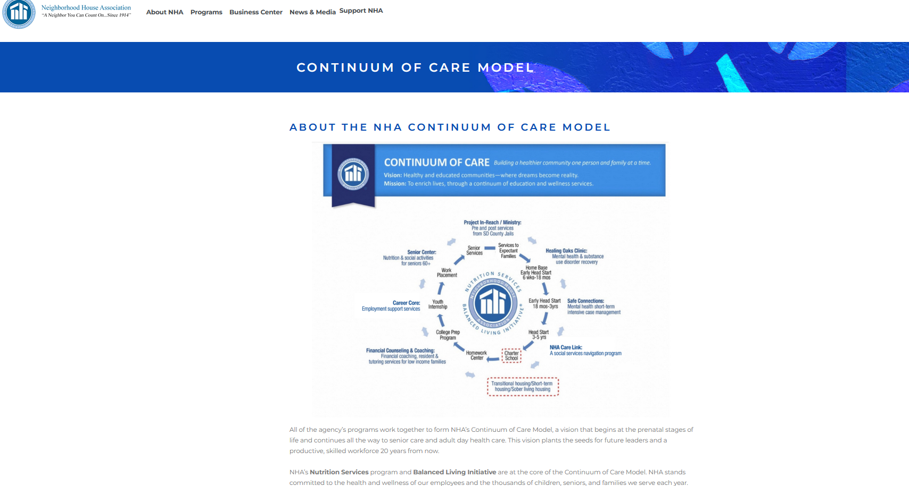
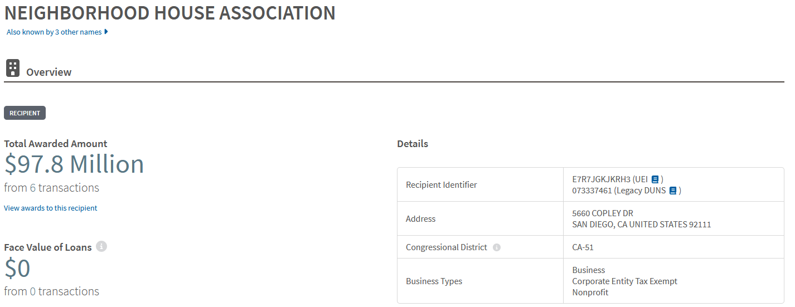
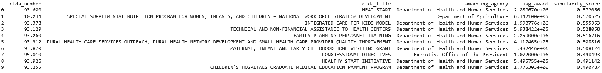

# grant_finder

A semantic grant matching system that takes a plain-language description of an organization and returns the most relevant federal grant programs, explained by an LLM.

## The Problem

The federal government distributes over $500 billion annually across thousands of grant programs. Nonprofits, universities, and small businesses looking for funding either pay for expensive tools like Instrumentl or spend hours doing manual keyword searches on Grants.gov. Neither works well when your organization's mission doesn't use the same vocabulary as the grant listing.

This project uses semantic search to bridge that gap. Instead of keyword matching, it embeds both the organization's description and the grant program profiles into the same vector space, then finds the closest matches by meaning rather than exact wording.

## How It Works

A user provides a plain-language description of their organization. The system embeds that description using a sentence transformer model, searches a FAISS index of 1,222 federal grant program vectors, and passes the top matches to Llama 3.1 which explains why each program is or isn't a good fit and flags any eligibility concerns.

The whole pipeline runs in about 1.2 seconds.

## Data

All data comes from the USASpending.gov FY2023 financial assistance bulk download, which covers every federal grant and cooperative agreement awarded in fiscal year 2023.

After filtering to competitive grants (project grants and cooperative agreements) for nonprofits, universities, and small businesses, the dataset contains 275,597 award records across 23,111 unique organizations and 1,222 CFDA grant programs.

HHS accounts for 55% of awards, followed by NSF at 10% and DoD at 6%.

One interesting finding from the data exploration: 73% of organizations in the dataset received funding from only one or two programs. This confirms the discovery gap the project is trying to address. Most grant-seeking organizations have a very narrow view of what's available to them.

The data also revealed why the system embeds grant profiles rather than org profiles. 43% of organizations have fewer than 200 characters of combined description text, which is too sparse to embed meaningfully. Grant programs, by contrast, aggregate descriptions from hundreds of recipients and always produce dense, embeddable text. A new organization's short self-description gets matched against these rich grant program vectors rather than sparse org profiles.

## Architecture

The pipeline is split across five notebooks:

notebook_01_data_acquisition.ipynb
Explores the USASpending API, identifies its limitations for bulk use, downloads the full FY2023 financial assistance archive (11GB across 7 CSV files), and filters it down to the relevant records using chunked processing. Outputs grant_recipients_2023.csv and org_profiles.csv.

notebook_02_feature_engineering.ipynb
Builds grant program profiles by aggregating all transaction descriptions for each CFDA program. Handles sparse profiles (under 200 chars) by falling back to the program title, and truncates giant profiles at 50,000 characters. Cleans and parses org profile fields. Outputs grant_profiles.csv.

notebook_03_embedding_and_index.ipynb
Embeds all 1,222 grant program profiles using the all-MiniLM-L6-v2 sentence transformer model (384 dimensions). Builds a FAISS IndexFlatIP with L2-normalized vectors for cosine similarity search. Outputs grant_embeddings.npy and grant_index.faiss.

notebook_04_matching_pipeline.ipynb
Defines the core search and explanation functions. search_grants() embeds a query and returns the top k matches from the FAISS index. explain_matches() passes those results to Llama 3.1 via Groq with a structured prompt asking for fit analysis, eligibility concerns, and priority recommendations. find_grants() runs the full pipeline end to end.

notebook_05_evaluation_and_demo.ipynb
Runs the system against four realistic organization profiles (rural health nonprofit, university energy research lab, AgTech small business, Native language preservation nonprofit) and evaluates results. Documents known limitations and potential improvements.

---

## FAISS and Cosine Similarity

FAISS runs on memory, so it doesnt not require a database setup. It was designed by meta specifically for similarity search on vectors. Each embedding is a vector of 384 numbers that represeents a point in 384 dimensional space. Cosine similairty represents the angle between the vectors. Two two texts with similar subjects will point in roughly the same direction. 

## Example Output - Neighborhood House

To test the system, we used a real organization that appears in the FY2023 USASpending data: the Neighborhood House Association (NHA), a large nonprofit human services agency in San Diego that received $97.4 million in federal grants in FY2023, almost entirely from Head Start (CFDA 93.600).

The goal was to see if the system could surface Head Start as a top match using only text from NHA's public website, with no knowledge of their actual grant history.

### The Organization

NHA describes itself as one of San Diego County's largest nonprofit human services agencies, offering 28 programs across 125 locations including early childhood education, youth development, mental health services, senior services, and workforce development.

### Their Actual Grant

According to USASpending.gov, NHA received $97.4 million from Head Start (CFDA 93.600) in FY2023.

### What the System Found

We ran two queries through grant_finder:

First, NHA's generic about page description, which talks about their history, staff count, and broad service areas without mentioning specific programs. Head Start ranked 22nd out of 1,222 programs with a similarity score of 0.44.

Then, a more detailed description from their Continuum of Care page, which specifically mentions Early Head Start, prenatal services, children ages 0-5, and kindergarten readiness programs. Head Start jumped to #1 out of 1,222 programs.

This demonstrates two things. The system correctly identifies Head Start as the top match when given enough programmatic detail. And query specificity matters — a detailed description of what you actually do will outperform a generic mission statement every time.

The match is purely semantic. The system has no knowledge of NHA's grant history. It matched based on language overlap between NHA's program description and the aggregated text of how Head Start funded work gets described across its 1,060 recipient organizations.

---

## Limitations

The embedding model truncates input at 256 tokens, so only the first ~200 words of each grant profile influence the vector. The dataset covers FY2023 only, so programs that award on a multi-year cycle may be missing. The system has no way to check whether a grant program is currently accepting applications. The LLM occasionally invents specific details not present in the program description, which is a known issue with smaller models. The system covers federal grants only and does not include state, foundation, or corporate funding sources.

## Potential Improvements

Adding FY2021 and FY2022 data would help catch grant programs that don't award every year and are currently missing from the index. Integrating the Grants.gov API would allow the system to filter results by currently open opportunities rather than showing programs that may not be accepting applications. Switching to a larger embedding model like all-mpnet-base-v2 could improve semantic matching quality, and upgrading to a larger LLM would reduce the occasional hallucination in grant explanations. A Gradio interface would also make the system accessible without needing to run notebooks directly.

## Data Source

USASpending.gov FY2023 Financial Assistance Archive
https://www.usaspending.gov/download_center/award_data_archive

The raw data files are not included in this repository due to size. Run notebook_01 to download and process them. Processed outputs are also excluded from the repo and will be generated by running the notebooks in order.
